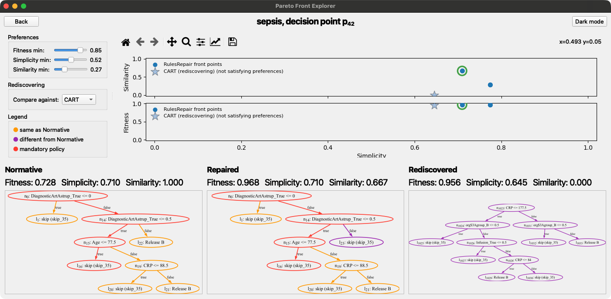

# RulesRepair

**Repairing decision rules in data-aware process models.**

When a process changes, the normative decision rules prescribed by domain experts have to be adapted. 
Rediscovering the rules from scratch descards normative knowledge, including mandatory requirements.
RulesRepair represents decision rules as decision trees, in line with the literature, and returns a Pareto repertoire 
of repaired trees balancing **accuracy**, **simplicity**, and **similarity** to the original rule and preserving 
normative requirements.


## Requirements

To run RulesRepair, you need to have installed:

* [Python 3.9](https://www.python.org/downloads/)
* [Poetry 2.2.1](https://python-poetry.org/docs/#installation), used to install the dependencies specified in `pyproject.toml`.
* [Graphviz](https://graphviz.org/download/), required by the `graphviz` Python package to render decision trees.
* [JDK 17](https://www.oracle.com/java/technologies/javase/jdk17-archive-downloads.html) (optional), required only for the Weka C4.5/REPTree.

## Installation

Clone the repository and install the dependencies:

```bash
git clone https://github.com/KDMG/RulesRepair/
cd RulesRepair/

poetry env use python3.9
poetry install
```

## Reproducing the Experiments

To reproduce the experiments according to our experimental setup, first launch the repair algorithm for each dataset, 
then run the quantitative and qualitative evaluation.
For each command, replace `<dataset>` with the desired dataset name, e.g., `sepsis`. 
The available datasets are listed in the [datasets](https://github.com/KDMG/RulesRepair/tree/main/datasets) folder.

The experimental results and the evaluations reported in our paper are available in the 
[experiments](https://github.com/KDMG/RulesRepair/tree/main/experiments) and 
[evaluation](https://github.com/KDMG/RulesRepair/tree/main/evaluation) folders.

### Running the Experimental Pipeline

To run the experiments for a dataset, execute:

```bash
poetry run python run_pipeline.py --dataset <dataset> --seeds 0,1,2,3,4,5,6,7,8,9,10,11,12,13,14,15,16,17,18,19,20,21,22,23,24,25,26,27,28,29
```

#### Output Layout

All files produced by `run_pipeline.py` for a dataset are stored under `experiments/<dataset>/`, which contains:
* `<dataset>_cut/`: the mined Petri net (`pn_normative.pnml`) and the XES splits;
* `decision_points/`: the extracted decision points and `normative_model.pkl`, used to generate the mutations;
* `repair/`: the repair results, by seed.

If the required files already exist in `<dataset>_cut/` and `decision_points/`, `run_pipeline.py` 
reuses them instead of overwriting them. 
This also allows the pipeline to be executed with custom inputs. 
For example, a specific Petri net for a dataset can be placed directly in the 
corresponding `<dataset>_cut/` directory.

## Quantitative Evaluation

The following commands reproduce the quantitative analyses reported in the paper.

### Computational Time

```bash
poetry run python -m analysis.core.computational_time \
    experiments/<dataset>/repair/seed_*/*/mutated/results.csv
```

See results in `evaluation/quantitative/<dataset>/timing/time_delta_overall.csv`.

### RQ1: does the Pareto set produced by RulesRepair contains solutions dominated by rediscovering algorithms?

Run:

```bash
poetry run python -m analysis.rq1 dominance-summary \
    experiments/<dataset>/repair/seed_*/*/mutated/analysis/pareto_per_trial.csv
```

and:

```bash
poetry run python -m analysis.rq1 dominance-advantage \
    experiments/<dataset>/repair/seed_*/*/mutated/analysis/pareto_per_trial.csv
```

`dominance-summary` reports the percentage of times in which rediscovering dominates at least one solution of the Pareto front produced by RulesRepair.
`dominance-advantage` reports the gaps in accuracy, simplicity and similarity for RulesRepair solutions dominated by Mine.
Every result is aggregated by dataset, decision point, mutation type.

To obtain the combined latex tables shown in our paper, run:

```bash
poetry run python -m analysis.rq1 dominance-summary \
    -combine evaluation/quantitative/*/rq1/dominance_summary/dominance_by_dataset.csv
poetry run python -m analysis.rq1 dominance-advantage \
    -combine evaluation/quantitative/*/rq1/dominance_advantage/dominance_advantage_by_dataset.csv
```

### RQ2: what is the extent to which RulesRepair enables the exploration of different trade-offs among fitness, simplicity and similarity, compared with rediscovering?

Run:

```bash
poetry run python -m analysis.rq2.statistical multi-baseline-table \
    experiments/<dataset>/repair/seed_*/*/mutated/analysis/pareto_per_trial.csv \
    --dataset <dataset> \
    --trial-level --by-dataset
```

To obtain the combined latex table shown in our paper, run:

```bash
poetry run python -m analysis.rq2.statistical holm-table \
    evaluation/quantitative/*/rq2/multi_baseline_table/rq_unified_trial_level_by_dataset_*.csv
```

### Additional analysis: how are the solutions in the objective space distributed when comparing RulesRepair with rediscovering?

Run once per dataset to compute the attainment fields:

```bash
poetry run python -m analysis.rq2.attainment_figures outputs \
    experiments/<dataset>/repair/seed_*/*/mutated/analysis/pareto_per_trial.csv \
    --dataset <dataset>
```

Saved under `evaluation/quantitative/<dataset>/rq2/attainment_outputs/`.

To render the figures for one dataset, pooled across every decision point:

```bash
poetry run python -m analysis.rq2.attainment_figures render-figures \
    --dataset <dataset> \
    --pareto-csvs experiments/<dataset>/repair/seed_*/*/mutated/analysis/pareto_per_trial.csv \
    --dataset-level
```

## Qualitative Evaluation

RulesRepair ships with an interactive **Pareto Front Explorer**.



Launch it with:

```bash
poetry run python pareto_explorer/app.py
```

To reproduce the exact qualitative evaluation reported in our paper, the required files and detailed instructions are provided in the [qualitative](https://github.com/KDMG/RulesRepair/tree/main/evaluation/qualitative) folder.

## Contact

For questions or further information, please contact:

| Contributor | Contact |
| :--- | :--- |
| Chiara Gobbi | c.gobbi@pm.univpm.it |
